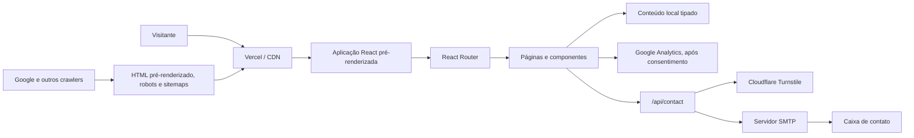
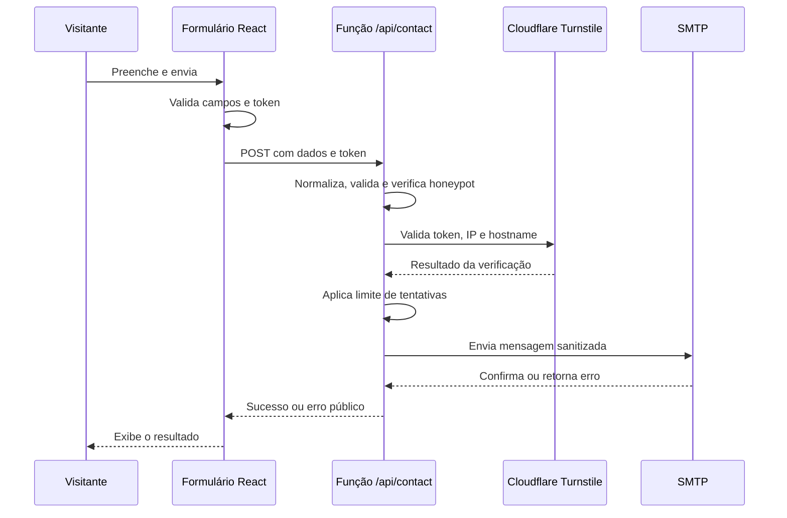

# Documentação funcional, arquitetura e backlog do site RodrigoAI

> Estado analisado em 26 de julho de 2026  
> Site: https://www.rpovoadata.tech  
> Repositório: `rodrigoai-personal`

## 1. Objetivo deste documento

Este documento consolida:

- as funcionalidades atualmente implementadas;
- a arquitetura técnica e os principais fluxos do sistema;
- as configurações necessárias para operação;
- riscos, limitações e débitos técnicos observados;
- oportunidades de evolução organizadas em um backlog priorizado;
- critérios que ajudam a transformar sugestões em entregas verificáveis.

Ele deve ser atualizado sempre que houver mudança relevante de arquitetura, inclusão de uma página, nova integração, alteração no tratamento de dados pessoais ou conclusão de um item estrutural do backlog.

## 2. Visão do produto

O RodrigoAI é o portfólio profissional de Rodrigo Póvoa. O site posiciona o autor como Technical Data Leader e Data Analytics Engineer, apresentando experiência, competências, visão sobre dados e inteligência artificial, projetos paralelos, publicações e canais de contato.

### 2.1 Públicos principais

1. Recrutadores e empresas procurando liderança técnica em dados.
2. Gestores e decisores avaliando experiência em arquitetura, analytics e IA.
3. Profissionais interessados em conteúdo técnico e liderança.
4. Potenciais parceiros ou clientes da Sapiente.AI.
5. Mecanismos de busca e plataformas sociais que indexam ou compartilham o conteúdo.

### 2.2 Objetivos de negócio

- comunicar autoridade profissional de forma clara;
- centralizar experiência, competências e projetos;
- gerar oportunidades por meio do formulário de contato;
- ampliar descoberta orgânica por SEO e conteúdo editorial;
- fortalecer a ligação entre a marca pessoal e a Sapiente.AI;
- medir navegação respeitando o consentimento do visitante.

### 2.3 Indicadores recomendados

O site já possui a base para mensuração com GA4. Os indicadores a acompanhar devem incluir:

- visitas orgânicas e páginas de entrada;
- visualizações das páginas Professional, Why Me e Side Projects;
- leitura dos artigos do blog;
- cliques em Contact, LinkedIn, GitHub e Sapiente.AI;
- início, erro e conclusão do formulário;
- taxa de consentimento de analytics;
- Core Web Vitals;
- páginas indexadas, impressões, cliques e posição no Google Search Console.

## 3. Inventário funcional atual

### 3.1 Navegação e experiência global

- aplicação de página única com navegação pelo React Router;
- menu responsivo para desktop e dispositivos móveis;
- atalho de acessibilidade para ir diretamente ao conteúdo principal;
- tema escuro e claro, com preferência armazenada localmente;
- retorno automático ao topo ao trocar de página;
- rodapé com navegação, contato, política de privacidade e redes sociais;
- carregamento sob demanda das páginas e de várias seções;
- tratamento global de falhas inesperadas por Error Boundary;
- animações e transições visuais com uma implementação local leve compatível com a API usada no projeto.

### 3.2 Página inicial — `/`

A página inicial funciona como resumo executivo do portfólio e inclui:

- apresentação principal e posicionamento profissional;
- resumo sobre o autor;
- competências centrais;
- projetos estratégicos;
- motivações e princípios profissionais;
- resumo da carreira;
- chamada para contato;
- carregamento adiado de seções fora da área visível para reduzir o trabalho inicial do navegador.

### 3.3 Why Me — `/why-me`

Apresenta os diferenciais profissionais e a proposta de valor, com foco em:

- mentalidade Engineering First;
- tradução de complexidade técnica em valor de negócio;
- liderança e alinhamento entre áreas;
- Data as a Product;
- arquitetura AI-Native;
- colaboração entre pessoas e IA;
- confiança, governança e visão estratégica.

### 3.4 Professional — `/professional`

Centraliza a trajetória profissional:

- introdução e resumo executivo;
- stack técnica e tempo de experiência;
- linha do tempo profissional;
- formação acadêmica;
- certificações e cursos;
- idiomas.

O conteúdo é alimentado principalmente pelo objeto estruturado em `src/data/profile.ts`.

### 3.5 Personal — `/personal`

Humaniza a marca pessoal por meio de:

- filosofia pessoal;
- mudança de vida e contexto de relocalização;
- hobbies e interesses;
- esportes;
- valores;
- influências;
- exploração do ecossistema de IA.

### 3.6 Innovation Hub — `/side-projects`

Apresenta a Sapiente.AI como laboratório e ecossistema de inovação:

- propósito e posicionamento;
- áreas de exploração em IA;
- plataformas de dados aumentadas por IA;
- automação inteligente;
- presença digital e interfaces inteligentes;
- prototipagem;
- chamada externa para o site da Sapiente.AI.

### 3.7 Blog — `/blog` e `/blog/:slug`

O blog é baseado em conteúdo local tipado:

- catálogo de artigos;
- cards com imagem, categoria, data e tempo estimado de leitura;
- página individual por slug;
- conteúdo estruturado em seções;
- referências externas;
- ligação para a publicação original e LinkedIn quando disponíveis;
- metadados de artigo;
- dados estruturados Schema.org para Blog, ItemList, Article e breadcrumbs;
- pré-renderização dos artigos durante o build;
- inclusão automática dos artigos no sitemap gerado durante o build.

Atualmente, os artigos são mantidos em `src/data/blogPosts.ts`. Não existe CMS ou área administrativa.

### 3.8 Contato — `/contact`

O formulário oferece:

- campos de nome, e-mail, telefone opcional, assunto e mensagem;
- validações no navegador;
- limite de tamanho por campo;
- estados de carregamento, sucesso e erro;
- foco direcionado à mensagem de sucesso;
- honeypot invisível contra bots;
- Cloudflare Turnstile;
- envio para uma função serverless;
- validação independente no servidor;
- sanitização do conteúdo antes da composição do e-mail;
- envio SMTP com Nodemailer;
- respostas públicas controladas para não expor detalhes internos;
- limitação básica de tentativas por IP.

### 3.9 Privacidade e analytics

- Google Consent Mode v2 começa negado por padrão;
- Google Analytics só é carregado após consentimento explícito;
- o visitante pode aceitar analytics ou manter apenas armazenamento necessário;
- a decisão fica armazenada no navegador;
- é possível reabrir as preferências pelo botão fixo de cookies;
- ao revogar o consentimento, cookies conhecidos do Analytics são removidos;
- mudanças de rota da SPA geram pageviews manuais;
- a política de privacidade está disponível em `/privacy`;
- o modal implementa foco inicial, ciclo de foco e isolamento do conteúdo de fundo.

### 3.10 SEO e descoberta

- títulos e descrições específicos por página;
- URLs canônicas;
- Open Graph e Twitter Cards;
- suporte a imagem social;
- Schema.org para pessoa, website, breadcrumbs, blog, lista e artigos;
- `robots.txt`;
- sitemap e sitemap index;
- pré-renderização da home, catálogo do blog e artigos;
- idioma e locale configuráveis nos metadados;
- favicons e imagens otimizadas em WebP.

### 3.11 Segurança da aplicação

- Content Security Policy restritiva;
- Trusted Types obrigatórios para scripts;
- bootstrap de produção validado por hash;
- bloqueio de iframes por terceiros;
- política restritiva de permissões do navegador;
- proteção contra MIME sniffing;
- referrer policy;
- upgrade automático de requisições inseguras;
- validação e escape de dados no formulário;
- Turnstile com validação de hostname;
- segredos mantidos no ambiente de execução, não no código-fonte.

### 3.12 Funcionalidade desativada

Existe uma base antiga para o Povoabot, mas o chat está desativado:

- `ChatWidget.tsx` não renderiza interface;
- a função relacionada está preservada em arquivo marcado como desativado;
- a chave OpenAI não faz parte do fluxo ativo.

Essa base não deve ser considerada uma funcionalidade disponível em produção.

## 4. Arquitetura atual

### 4.1 Visão geral



### 4.2 Camadas

| Camada | Responsabilidade | Tecnologias e locais principais |
|---|---|---|
| Apresentação | Interface, páginas, responsividade, temas e animações | React, TypeScript, Tailwind, `src/pages`, `src/components` |
| Navegação | Rotas e carregamento sob demanda | React Router, `src/routes.tsx` |
| Conteúdo | Perfil, experiências, projetos e artigos | `src/data` |
| Layout e design system | Estrutura visual reutilizável e componentes primitivos | `src/components/layout`, `src/components/ui` |
| SEO | Metadados, Schema.org, pré-renderização e sitemaps | `SEO.tsx`, `src/components/seo`, `scripts/prerender.mjs` |
| Privacidade e medição | Consentimento e pageviews | `PrivacyConsent.tsx`, `src/lib/analytics.ts` |
| Backend | Processamento seguro do formulário | `api/contact.ts` |
| Hospedagem e segurança | Rewrites, cache e cabeçalhos HTTP | Vercel, `vercel.json` |
| Qualidade | Lint, testes e build | ESLint, Vitest, TypeScript, Vite |

### 4.3 Estrutura do repositório

```text
api/                         Funções serverless
  contact.ts                 Endpoint ativo do formulário
public/                      Imagens, fontes, robots e sitemaps publicados
scripts/
  prerender.mjs              Pré-renderização e geração de sitemap no build
src/
  components/                Componentes funcionais e visuais
    layout/                  Layouts e seções reutilizáveis
    seo/                     Dados estruturados Schema.org
    ui/                      Primitivos de interface
  data/                      Conteúdo estruturado do perfil, blog e projetos
  hooks/                     Hooks reutilizáveis
  lib/                       Analytics, privacidade, segurança e utilitários
  pages/                     Páginas ligadas às rotas
  test/                      Configuração e testes gerais
  routes.tsx                 Definição central de rotas
  entry-server.tsx           Renderização usada pelo pré-render
  main.tsx                   Inicialização e hidratação no navegador
docs/                        Documentação do produto e arquitetura
vercel.json                  Hospedagem, rewrites, cache e cabeçalhos
vite.config.ts               Build, aliases, chunks e CSP bootstrap
```

### 4.4 Fluxo de renderização e publicação

1. O Vite compila a aplicação e gera os assets.
2. O script `prerender.mjs` inicia o renderer de servidor em modo de build.
3. Home, blog e artigos são renderizados em HTML.
4. Os metadados do React Helmet são inseridos no `<head>`.
5. Os sitemaps são reconstruídos com as páginas e artigos conhecidos.
6. A Vercel publica arquivos estáticos e a função de contato.
7. No navegador, o React hidrata o HTML pré-renderizado.
8. As demais rotas funcionam como SPA por meio dos rewrites da Vercel.

Observação: nem todas as páginas institucionais são pré-renderizadas atualmente. Elas aparecem no sitemap, mas dependem do fallback da SPA para seu conteúdo.

### 4.5 Fluxo do formulário de contato



### 4.6 Fluxo de consentimento

1. O Consent Mode é inicializado como negado.
2. A preferência anterior é lida do armazenamento local.
3. Sem decisão anterior, o modal de privacidade é aberto.
4. Ao aceitar, o script do GA4 é carregado e a página atual é registrada.
5. Ao rejeitar, analytics permanece desativado.
6. O visitante pode mudar a decisão posteriormente.
7. Cada mudança de rota registra um pageview apenas quando permitido.

## 5. Dados, integrações e configuração

### 5.1 Variáveis de ambiente

| Variável | Local | Obrigatória | Finalidade |
|---|---|---:|---|
| `VITE_GA_MEASUREMENT_ID` | Cliente | Para analytics | Measurement ID do GA4 |
| `VITE_TURNSTILE_SITE_KEY` | Cliente | Para contato | Chave pública do Turnstile |
| `TURNSTILE_SECRET_KEY` | Servidor | Para contato | Segredo do Turnstile |
| `TURNSTILE_ALLOWED_HOSTNAMES` | Servidor | Recomendada | Hostnames aceitos pelo Turnstile |
| `SMTP_HOST` | Servidor | Sim | Host SMTP |
| `SMTP_PORT` | Servidor | Sim | Porta SMTP |
| `SMTP_USER` | Servidor | Sim | Usuário/remetente |
| `SMTP_PASSWORD` | Servidor | Sim | Senha da caixa de e-mail |
| `CONTACT_EMAIL_TO` | Servidor | Sim | Destinatário final |

As variáveis prefixadas com `VITE_` são incorporadas no cliente e, portanto, nunca devem conter segredos.

### 5.2 Dependências externas

- Vercel: hospedagem, CDN, função serverless, variáveis e firewall;
- Cloudflare Turnstile: proteção do formulário;
- servidor Securemail: entrega SMTP;
- Google Analytics: medição consentida;
- Google Search Console: indexação e desempenho orgânico;
- LinkedIn, GitHub e Sapiente.AI: destinos externos.

### 5.3 Persistência

Não existe banco de dados. A persistência está limitada a:

- conteúdo versionado no repositório;
- preferência de tema no armazenamento local;
- consentimento de analytics no armazenamento local;
- estado temporário de rate limit na memória da instância serverless;
- mensagens entregues por e-mail.

## 6. Operação e manutenção

### 6.1 Comandos principais

| Comando | Uso |
|---|---|
| `npm run dev` | Desenvolvimento local |
| `npm run build` | Build de produção, pré-render e sitemap |
| `npm run preview` | Validação local do build |
| `npm run lint` | Análise estática |
| `npm test` | Testes automatizados |

### 6.2 Publicação de um novo artigo

1. Adicionar o artigo tipado em `src/data/blogPosts.ts`.
2. Adicionar a imagem otimizada em `public`.
3. Preencher slug único, título, descrição, categoria, datas, imagem e texto alternativo.
4. Incluir seções, referências e fonte quando aplicável.
5. Executar lint, testes e build.
6. Conferir a página pré-renderizada e os dados estruturados.
7. Conferir se o artigo entrou no sitemap gerado.
8. Publicar e solicitar indexação no Search Console quando necessário.

### 6.3 Atualização do perfil

O conteúdo profissional central deve ser alterado em `src/data/profile.ts`. Depois da mudança:

- conferir números, datas e consistência de nomenclatura;
- validar o comportamento responsivo das listas e timeline;
- executar os checks do projeto;
- conferir os metadados caso o posicionamento profissional tenha mudado.

### 6.4 Checklist de publicação

- [ ] Conteúdo e links revisados.
- [ ] Nenhum segredo adicionado ao repositório.
- [ ] `npm run lint` concluído.
- [ ] `npm test` concluído.
- [ ] `npm run build` concluído.
- [ ] Home, páginas alteradas e formulário validados em desktop e mobile.
- [ ] Tema claro e escuro validados.
- [ ] Navegação por teclado e foco validados.
- [ ] Metadados e imagem social conferidos.
- [ ] Sitemap e `robots.txt` conferidos.
- [ ] Variáveis de produção presentes.
- [ ] Logs da função de contato sem erros após a publicação.

## 7. Pontos fortes observados

- separação razoável entre páginas, layout, UI, dados e integrações;
- TypeScript em todo o fluxo principal;
- carregamento sob demanda e pré-renderização parcial;
- SEO técnico acima do padrão de um portfólio pessoal;
- Consent Mode e escolha explícita do visitante;
- cuidados reais de acessibilidade no menu e no modal;
- CSP, Trusted Types e cabeçalhos de segurança bem mais restritivos que o padrão;
- validação redundante do formulário no cliente e servidor;
- proteção do contato por honeypot, Turnstile e limite de frequência;
- conteúdo centralizado em estruturas locais, simples de versionar;
- imagens otimizadas e fonte local, reduzindo dependência de terceiros.

## 8. Limitações e riscos atuais

### 8.1 Rate limit não durável

O endpoint mantém contadores em memória. Funções serverless podem iniciar várias instâncias ou descartar o estado, portanto esse mecanismo não garante o limite global. O README recomenda uma regra no Vercel Firewall, que deve ser considerada a proteção efetiva.

### 8.2 Cobertura de testes muito pequena

Há testes para Trusted Types e um teste de exemplo, mas os fluxos essenciais não têm cobertura adequada. Contato, consentimento, analytics, rotas, SEO e conteúdo não possuem uma rede de regressão proporcional à importância.

### 8.3 Rota 404 não conectada

O componente `NotFound.tsx` existe, porém não há uma rota curinga `*` na configuração atual. URLs desconhecidas podem cair no HTML da aplicação sem uma experiência 404 apropriada.

### 8.4 Pré-renderização parcial

A home, o blog e os artigos são pré-renderizados. Outras páginas estratégicas estão no sitemap, mas não recebem HTML específico durante o build. Isso cria uma diferença de qualidade de entrega entre páginas.

### 8.5 Conteúdo sem CMS

Toda alteração editorial exige editar código, validar e publicar. Isso é simples e seguro para baixo volume, mas aumenta o custo operacional quando a frequência de artigos crescer.

### 8.6 Dados de projetos pouco integrados

`src/data/projects.json` possui registros genéricos e não é a fonte principal da página Innovation Hub. Há também scripts antigos de sitemap fora do fluxo principal. Isso pode gerar confusão e divergência futura.

### 8.7 Analytics limitado a pageviews

O fluxo atual mede navegação, mas não há uma taxonomia explícita de eventos para conversões, cliques externos, interação com artigos, erro de formulário ou preferências de privacidade.

### 8.8 Observabilidade operacional limitada

Falhas do formulário aparecem nos logs da plataforma, mas não existe monitoramento centralizado, alerta, correlação de requisições ou painel de saúde.

### 8.9 Ausência de automação de qualidade documentada

O projeto possui comandos de lint, teste e build, mas não foi identificado no repositório um workflow versionado que obrigue esses checks antes de integrar mudanças.

### 8.10 Chatbot preservado, mas inativo

Manter código desativado por longo período aumenta superfície de manutenção e pode confundir futuras alterações. É necessário decidir entre remover completamente ou reativar com arquitetura, privacidade, custo e segurança definidos.

## 9. Backlog priorizado

Escala de esforço:

- **XS:** algumas horas;
- **S:** até aproximadamente dois dias;
- **M:** alguns dias;
- **L:** uma ou mais semanas;
- **XL:** iniciativa que deve ser dividida.

### 9.1 P0 — Confiabilidade e proteção

| ID | Item | Valor/risco tratado | Esforço | Critério de aceite |
|---|---|---|---:|---|
| P0-01 | Confirmar rate limit no Vercel Firewall | Evita abuso distribuído do formulário | S | Regra publicada para `POST /api/contact`, limite testado e resposta 429 observada |
| P0-02 | Criar testes do endpoint de contato | Protege validação, segurança e envio | M | Testes cobrem método inválido, honeypot, campos, Turnstile, rate limit, SMTP e sanitização |
| P0-03 | Adicionar rota 404 real | Corrige experiência e sinalização para URLs inválidas | XS | Rota `*` renderiza página 404, oferece retorno e não redireciona silenciosamente |
| P0-04 | Configurar pipeline de CI | Impede regressões básicas | S | Pull requests executam lint, testes e build; merge bloqueado em caso de falha |
| P0-05 | Criar monitoramento do formulário | Reduz tempo até detectar falhas de contato | M | Falhas recorrentes geram alerta sem expor conteúdo pessoal |
| P0-06 | Validar recuperação e rotação de credenciais | Reduz risco operacional e de segurança | S | Responsável, processo de rotação e teste de SMTP/Turnstile documentados |

### 9.2 P1 — SEO, conversão e qualidade

| ID | Item | Valor esperado | Esforço | Critério de aceite |
|---|---|---|---:|---|
| P1-01 | Pré-renderizar todas as páginas públicas | HTML completo para crawlers e compartilhamento | M | Todas as rotas públicas geram HTML com conteúdo, título, descrição e canonical próprios |
| P1-02 | Implementar eventos de conversão no GA4 | Permite medir resultados além de pageviews | M | Taxonomia documentada e eventos de contato, links externos, artigos e CTAs validados no DebugView |
| P1-03 | Ampliar testes de interface | Reduz regressões em fluxos críticos | M | Testes cobrem rotas, tema, consentimento, formulário e artigo inexistente |
| P1-04 | Auditoria de acessibilidade | Melhora inclusão e reduz falhas WCAG | M | Auditoria por teclado e ferramenta automatizada; problemas críticos corrigidos |
| P1-05 | Auditoria de Core Web Vitals | Melhora experiência e SEO | M | LCP, INP e CLS medidos em mobile; metas e regressões acompanhadas |
| P1-06 | Revisar estratégia de cache do `app.js` | Evita inconsistência entre HTML e bundle | S | Política de cache testada em publicação e rollback |
| P1-07 | Criar páginas de case study | Demonstra impacto, não apenas stack | L | Ao menos dois cases com contexto, decisão, arquitetura, resultado e aprendizados |
| P1-08 | Fortalecer CTAs e funil de contato | Aumenta conversão das páginas estratégicas | M | CTA contextual em páginas-chave e eventos medindo cada origem |
| P1-09 | Validar dados estruturados | Evita schemas inválidos ou inconsistentes | S | Home, blog e artigos aprovados nas ferramentas de resultados avançados |
| P1-10 | Padronizar títulos e descrições | Melhora consistência editorial e SERP | S | Todas as páginas seguem convenção documentada e limites recomendados |

### 9.3 P2 — Conteúdo e evolução do produto

| ID | Item | Valor esperado | Esforço | Critério de aceite |
|---|---|---|---:|---|
| P2-01 | Criar modelo editorial do blog | Aumenta consistência e frequência | S | Template define resumo, tese, seções, referências, CTA, imagem e revisão |
| P2-02 | Adicionar filtros e busca no blog | Melhora descoberta quando o catálogo crescer | M | Busca por texto e filtro por categoria acessíveis e compartilháveis por URL |
| P2-03 | Relacionar artigos | Aumenta profundidade de navegação | S | Artigos exibem conteúdos relacionados por categoria ou tags |
| P2-04 | Criar RSS/Atom | Facilita distribuição do conteúdo | S | Feed válido, descobrível no HTML e atualizado no build |
| P2-05 | Internacionalização EN/PT | Amplia alcance em Portugal, Brasil e mercado global | XL | Estratégia de URL, hreflang, conteúdo e fallback definida antes da implementação |
| P2-06 | Transformar projetos em conteúdo estruturado | Evita dados genéricos e duplicados | M | Uma única fonte alimenta cards, páginas, schemas e sitemap |
| P2-07 | Adicionar páginas individuais de projetos | Demonstra profundidade técnica | L | Cada projeto possui slug, problema, solução, arquitetura, tecnologias e resultados |
| P2-08 | Criar newsletter opcional | Constrói audiência própria | L | Consentimento separado, double opt-in, política atualizada e métricas definidas |
| P2-09 | Automatizar imagens sociais | Melhora compartilhamento e consistência | M | Cada artigo/projeto gera OG image com título e identidade visual |
| P2-10 | Avaliar CMS headless | Reduz custo editorial em maior volume | L | ADR compara conteúdo local, Git CMS e CMS externo com custo, segurança e manutenção |

### 9.4 P3 — Exploração e diferenciação

| ID | Item | Hipótese | Esforço | Critério antes de iniciar |
|---|---|---|---:|---|
| P3-01 | Decidir o futuro do Povoabot | Conversa pode facilitar descoberta do perfil | M/XL | Caso de uso, fonte, custo, moderação, privacidade e métricas aprovados |
| P3-02 | Portfólio interativo de arquitetura | Diagramas podem demonstrar senioridade técnica | L | Conteúdo e público-alvo validados com protótipo simples |
| P3-03 | Assistente de navegação sem IA generativa | Recomenda páginas com menor custo e risco | M | Jornada mostra ganho sobre busca e menu tradicionais |
| P3-04 | Laboratório de demos da Sapiente.AI | Provas práticas podem gerar oportunidades | XL | Cada demo possui objetivo, orçamento, segurança e manutenção definida |
| P3-05 | Personalização por origem de campanha | Mensagens específicas podem elevar conversão | L | Base legal, limites de privacidade e experimento A/B definidos |

## 10. Sequência recomendada

### Fase 1 — Fundação confiável

1. P0-01: rate limit durável.
2. P0-03: rota 404.
3. P0-02 e P1-03: testes críticos.
4. P0-04: CI obrigatório.
5. P0-05: monitoramento do contato.

### Fase 2 — Descoberta e conversão

1. P1-01: pré-renderização completa.
2. P1-02: eventos de conversão.
3. P1-04 e P1-05: acessibilidade e performance.
4. P1-07 e P1-08: cases e CTAs.
5. P1-09 e P1-10: refinamento de SEO.

### Fase 3 — Escala editorial

1. P2-01: modelo editorial.
2. P2-06 e P2-07: projetos estruturados e páginas individuais.
3. P2-03 e P2-04: relacionados e feed.
4. P2-02: busca quando o volume justificar.
5. P2-10: CMS apenas quando o fluxo via código se tornar um gargalo real.

### Fase 4 — Diferenciação

Avaliar Povoabot, demos e experiências interativas com base em métricas de navegação, demanda real, custo e capacidade de manutenção.

## 11. Decisões de arquitetura recomendadas

Mudanças estruturais devem ser registradas como ADRs (Architecture Decision Records). As primeiras decisões a documentar são:

1. **Estratégia de renderização:** manter pré-render estático, adotar framework SSR/SSG ou ampliar o script atual.
2. **Fonte de conteúdo:** TypeScript local, Markdown/MDX, Git-based CMS ou headless CMS.
3. **Proteção do contato:** Vercel Firewall, armazenamento externo ou serviço de formulário.
4. **Observabilidade:** solução mínima para erros de frontend, função e disponibilidade.
5. **Internacionalização:** estrutura de URLs e governança de traduções.
6. **Povoabot:** remoção definitiva ou reativação com escopo e controles.

## 12. Definition of Done

Um item do backlog só deve ser considerado concluído quando:

- o critério de aceite foi atendido;
- lint, testes e build passam;
- a funcionalidade foi validada em desktop e mobile;
- tema claro e escuro foram conferidos quando aplicável;
- acessibilidade por teclado foi verificada;
- estados de carregamento, vazio, erro e sucesso foram tratados;
- metadados, sitemap e analytics foram atualizados quando aplicável;
- nenhuma informação sensível foi enviada ao cliente ou ao repositório;
- documentação e variáveis de ambiente foram atualizadas;
- existe plano de rollback para mudanças de maior risco;
- o resultado foi validado após a publicação.

## 13. Governança do backlog

Recomenda-se revisar este backlog mensalmente:

1. analisar Search Console, GA4, logs e mensagens recebidas;
2. reavaliar impacto, urgência e esforço;
3. limitar trabalho simultâneo;
4. priorizar confiabilidade antes de novas funcionalidades;
5. evitar iniciar um CMS, chatbot ou internacionalização sem evidência de necessidade;
6. arquivar sugestões que não tenham hipótese, público ou métrica de sucesso;
7. atualizar este documento e criar uma ADR para decisões estruturais.

## 14. Resumo executivo

O site já possui uma base técnica madura para um portfólio: conteúdo rico, design modular, SEO estruturado, pré-renderização parcial, analytics consentido e um formulário serverless protegido. O maior retorno de curto prazo não está em adicionar muitas funcionalidades, mas em consolidar confiabilidade, testes, observabilidade, pré-renderização completa e mensuração de conversões.

Depois dessa fundação, a evolução mais valiosa tende a ser conteúdo de alta evidência — especialmente cases detalhados e projetos estruturados. Funcionalidades mais ambiciosas, como CMS, internacionalização e chatbot, devem ser orientadas por volume editorial, público e métricas reais.
